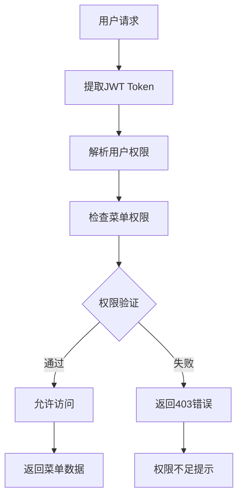

# Saturn MouseHunter 认证服务 - 菜单权限系统文档

## 概述

菜单权限系统是Saturn MouseHunter认证服务的核心功能之一，提供基于角色的动态菜单管理和细粒度权限控制。系统支持多用户类型、权限继承、动态菜单生成等高级特性。

## 🏗️ 系统架构

### 核心组件

```
菜单权限系统
├── 菜单数据模型 (Domain Models)
│   ├── MenuConfig - 菜单配置
│   ├── MenuTree - 菜单树结构
│   ├── UserMenuResponse - 用户菜单响应
│   └── MenuPermissionCheck - 权限检查结果
│
├── 菜单权限服务 (Services)
│   ├── MenuPermissionService - 核心业务逻辑
│   ├── 权限过滤算法
│   ├── 菜单权限验证
│   └── 统计分析功能
│
├── 权限验证中间件 (Middleware)
│   ├── @require_menu_permission - 单权限验证
│   ├── @require_menu_permissions - 多权限验证
│   └── MenuAccessValidator - 验证器类
│
└── API接口层 (Routes)
    ├── 用户菜单获取API
    ├── 权限检查API
    ├── 菜单统计API
    └── 管理员菜单API
```

## 📋 菜单配置结构

### 菜单类型

```python
class MenuType(str, Enum):
    MENU = "menu"      # 菜单项
    BUTTON = "button"  # 按钮
    TAB = "tab"        # 标签页
```

### 菜单配置模型

```python
class MenuConfig(BaseModel):
    id: str                    # 菜单唯一标识
    name: str                  # 菜单名称
    title: str                 # 显示标题
    path: Optional[str]        # 路由路径
    component: Optional[str]   # 组件路径
    icon: Optional[str]        # 菜单图标
    parent_id: Optional[str]   # 父菜单ID
    permission: Optional[str]  # 所需权限
    menu_type: MenuType        # 菜单类型
    sort_order: int           # 排序顺序
    is_hidden: bool           # 是否隐藏
    meta: Optional[Dict]      # 元数据
    children: Optional[List]  # 子菜单
```

## 🎭 预定义菜单结构

### 系统默认菜单

| 菜单ID | 菜单名称 | 路径 | 所需权限 | 描述 |
|--------|----------|------|----------|------|
| `dashboard` | 仪表盘 | `/dashboard` | `menu:dashboard` | 系统概览 |
| `user_management` | 用户管理 | `/users` | `menu:user_management` | 用户管理模块 |
| `role_management` | 角色管理 | `/roles` | `menu:role_management` | 角色权限管理 |
| `strategy_management` | 策略管理 | `/strategy` | `menu:strategy` | 策略配置 |
| `risk_management` | 风控管理 | `/risk` | `menu:risk` | 风险控制 |
| `system_management` | 系统设置 | `/system` | `menu:system` | 系统配置 |
| `reports` | 报表中心 | `/reports` | `menu:reports` | 数据报表 |
| `audit_logs` | 审计日志 | `/audit` | `menu:audit` | 操作审计 |

### 子菜单示例

```json
{
  "id": "user_management",
  "name": "user_management",
  "title": "用户管理",
  "path": "/users",
  "icon": "users",
  "permission": "menu:user_management",
  "children": [
    {
      "id": "admin_users",
      "title": "管理员用户",
      "path": "/users/admin",
      "permission": "user:read"
    },
    {
      "id": "tenant_users",
      "title": "租户用户",
      "path": "/users/tenant",
      "permission": "user:read"
    }
  ]
}
```

## 🔐 权限过滤机制

### 权限过滤算法

```python
async def filter_menus_by_permissions(
    menus: List[MenuConfig],
    user_permissions: Set[str]
) -> List[MenuTree]:
    """
    权限过滤核心逻辑:
    1. 检查菜单权限是否在用户权限集合中
    2. 递归处理子菜单
    3. 权限继承：有子菜单权限时显示父菜单
    4. 按排序顺序返回结果
    """
```

### 权限继承规则

1. **有子菜单权限** → 自动显示父菜单
2. **有父菜单权限** → 显示父菜单（子菜单按权限过滤）
3. **无任何权限** → 不显示该菜单分支
4. **无权限要求** → 默认显示（公共菜单）

### 用户权限映射

| 用户类型 | 典型权限 | 可访问菜单 |
|----------|----------|------------|
| 超级管理员 | 所有权限 | 全部菜单 |
| 租户管理员 | 租户级权限 | 用户管理、策略管理、报表 |
| 策略管理员 | 策略相关权限 | 仪表盘、策略管理 |
| 风控管理员 | 风控相关权限 | 仪表盘、风控管理、审计 |
| 普通用户 | 基础权限 | 仪表盘 |

## 🛡️ 权限验证机制

### 装饰器使用

#### 单权限验证
```python
@router.get("/dashboard")
@require_menu_permission("menu:dashboard")
async def dashboard_data(current_user: dict = Depends(get_current_user)):
    """需要仪表盘菜单权限"""
    return {"data": "dashboard_content"}
```

#### 多权限验证
```python
@router.get("/admin/users")
@require_menu_permissions(["menu:user_management", "user:read"])
async def list_users(current_user: dict = Depends(get_current_user)):
    """需要用户管理菜单权限和用户读取权限"""
    return {"users": []}
```

#### 任意权限验证
```python
@router.get("/reports")
@require_any_menu_permission(["menu:reports", "report:read"])
async def get_reports(current_user: dict = Depends(get_current_user)):
    """需要报表菜单权限或报表读取权限之一"""
    return {"reports": []}
```

### 权限验证流程



## 📊 统计分析功能

### 菜单统计指标

```python
class MenuStatsResponse(BaseModel):
    total_menus: int           # 菜单总数
    accessible_menus: int      # 可访问菜单数
    permission_coverage: float # 权限覆盖率
    menu_usage: Dict[str, int] # 菜单使用统计
```

### 覆盖率计算

```
权限覆盖率 = (可访问菜单数 / 总菜单数) × 100%
```

### 使用统计示例

```json
{
  "total_menus": 15,
  "accessible_menus": 12,
  "permission_coverage": 80.0,
  "menu_usage": {
    "dashboard": 1,
    "user_management": 1,
    "strategy_management": 1,
    "system_management": 0
  }
}
```

## 🔧 扩展配置

### 添加新菜单

1. **更新菜单配置**
```python
# 在DEFAULT_MENU_CONFIG中添加
MenuConfig(
    id="new_module",
    name="new_module",
    title="新功能模块",
    path="/new-module",
    permission="menu:new_module",
    sort_order=10
)
```

2. **添加对应权限**
```sql
INSERT INTO mh_auth_permissions (id, permission_code, permission_name, resource, action)
VALUES ('PERM_MENU_NEW', 'menu:new_module', '新模块菜单', 'menu', 'access');
```

3. **分配给角色**
```sql
INSERT INTO mh_auth_role_permissions (id, role_id, permission_id, granted_by)
VALUES ('RP_ADMIN_NEW_MENU', 'ROLE_SUPER_ADMIN', 'PERM_MENU_NEW', 'SYSTEM');
```

### 自定义权限验证

```python
class CustomMenuValidator:
    async def validate_business_logic(self, user_id: str, menu_id: str) -> bool:
        """自定义业务逻辑验证"""
        # 实现特定的业务验证逻辑
        return True

# 使用自定义验证器
@router.get("/custom-endpoint")
async def custom_endpoint(
    current_user: dict = Depends(get_current_user),
    validator: CustomMenuValidator = Depends()
):
    is_valid = await validator.validate_business_logic(
        current_user["user_id"],
        "custom_menu"
    )
    if not is_valid:
        raise HTTPException(status_code=403)
    return {"data": "custom_content"}
```

## 🎯 最佳实践

### 1. 权限粒度设计
- **菜单级权限**: 控制菜单显示/隐藏
- **功能级权限**: 控制具体操作
- **数据级权限**: 控制数据访问范围

### 2. 权限命名规范
```
格式: {资源}:{操作}
菜单权限: menu:{模块名}
功能权限: {资源}:{action}
示例: menu:dashboard, user:read, strategy:write
```

### 3. 角色权限分配
- **最小权限原则**: 只分配必要权限
- **职责分离**: 不同角色承担不同职责
- **定期审查**: 定期清理过期权限

### 4. 前端集成建议
- **动态菜单渲染**: 根据API返回的菜单结构渲染
- **路由守卫**: 在路由级别验证权限
- **权限缓存**: 合理使用权限缓存提升性能
- **错误处理**: 优雅处理权限不足的情况

## 🔒 安全考虑

### 1. 权限验证层次
- **Token验证**: 确保用户已认证
- **权限检查**: 验证用户具有所需权限
- **数据隔离**: 确保数据访问范围正确

### 2. 防护措施
- **权限缓存**: 避免频繁数据库查询
- **权限刷新**: 支持权限变更后及时生效
- **审计日志**: 记录权限相关操作

### 3. 攻击防护
- **越权检查**: 防止水平/垂直越权
- **参数验证**: 验证所有输入参数
- **错误信息**: 避免泄露敏感信息

---

**最后更新**: 2025-09-16
**版本**: 1.0.0
**维护者**: Saturn MouseHunter Team