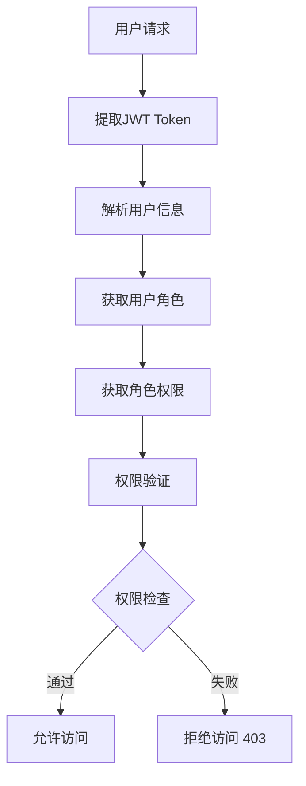

# Saturn MouseHunter 认证服务 - 权限系统文档

## 概述

Saturn MouseHunter 认证服务采用基于角色的访问控制（RBAC）模型，提供灵活的多租户权限管理系统。

## 系统架构

### 核心概念

- **用户 (User)**: 系统的使用者，分为管理员用户和租户用户
- **角色 (Role)**: 权限的集合，可以分配给用户
- **权限 (Permission)**: 对特定资源执行特定操作的许可
- **资源 (Resource)**: 系统中被保护的对象
- **操作 (Action)**: 对资源可执行的动作

## 🎭 用户类型 (UserType)

```python
class UserType(str, Enum):
    ADMIN = "ADMIN"      # 管理员用户
    TENANT = "TENANT"    # 租户用户
```

### 管理员用户 (ADMIN)
- **作用域**: 系统级别，跨租户管理
- **用途**: 系统管理、平台运维、全局配置
- **特点**: 拥有系统最高权限，可以管理所有租户

### 租户用户 (TENANT)
- **作用域**: 租户级别，仅限本租户内
- **用途**: 业务操作、租户内管理
- **特点**: 权限限制在所属租户范围内

## 🎯 角色范围 (RoleScope)

```python
class RoleScope(str, Enum):
    GLOBAL = "GLOBAL"      # 全局角色
    TENANT = "TENANT"      # 租户角色
    SYSTEM = "SYSTEM"      # 系统角色
```

### 全局角色 (GLOBAL)
- 跨租户有效的角色
- 通常分配给管理员用户
- 具有全局视图和操作权限

### 租户角色 (TENANT)
- 仅在特定租户内有效
- 分配给租户用户
- 权限范围限制在租户内

### 系统角色 (SYSTEM)
- 系统级别的角色
- 用于系统维护和管理
- 具有最高级别的系统权限

## 👑 预定义角色

### 超级管理员 (super_admin)
```sql
角色ID: ROLE_SUPER_ADMIN
角色编码: super_admin
角色名称: 超级管理员
描述: 拥有所有权限的系统管理员
```

**权限清单**:
- `system:admin` - 系统管理权限
- `user:read` - 用户查看权限
- `user:write` - 用户管理权限
- `role:read` - 角色查看权限
- `role:write` - 角色管理权限

## 🔐 权限系统详解

### 权限编码格式

权限采用 `resource:action` 的命名格式：

```
格式: {资源名}:{操作类型}
示例: user:read, role:write, system:admin
```

### 核心权限分类

#### 1. 用户管理权限
| 权限编码 | 权限名称 | 描述 |
|---------|---------|------|
| `user:read` | 用户查看 | 查看用户信息、用户列表 |
| `user:write` | 用户管理 | 创建、更新、删除用户 |

#### 2. 角色管理权限
| 权限编码 | 权限名称 | 描述 |
|---------|---------|------|
| `role:read` | 角色查看 | 查看角色信息、角色列表 |
| `role:write` | 角色管理 | 创建、更新、删除角色 |

#### 3. 系统管理权限
| 权限编码 | 权限名称 | 描述 |
|---------|---------|------|
| `system:admin` | 系统管理 | 系统配置、平台管理 |

### 操作类型 (Actions)

| 操作 | 描述 | 使用场景 |
|-----|------|---------|
| `create` | 创建 | 新建资源 |
| `read` | 读取/查看 | 查询、列表、详情 |
| `update` | 更新 | 修改资源 |
| `delete` | 删除 | 删除资源 |
| `write` | 写入 | 包含create/update/delete |
| `execute` | 执行 | 执行特定操作 |
| `manage` | 管理 | 完整管理权限 |

### 资源类型 (Resources)

| 资源 | 描述 | 相关权限 |
|-----|------|---------|
| `user` | 用户资源 | user:read, user:write |
| `role` | 角色资源 | role:read, role:write |
| `system` | 系统资源 | system:admin |

## 📊 权限等级层次

```
系统级权限
├── 超级管理员 (super_admin)
│   ├── 系统管理 (system:admin)
│   ├── 用户管理 (user:write)
│   ├── 角色管理 (role:write)
│   └── 所有读取权限
│
租户级权限
├── 租户管理员 (tenant_admin)
│   ├── 租户用户管理 (user:write - 租户范围)
│   └── 租户内角色管理 (role:write - 租户范围)
│
普通权限
├── 用户查看 (user:read)
├── 角色查看 (role:read)
└── 基础操作权限
```

## 🎪 权限分配机制

### 用户-角色关系
```python
class UserRoleOut(BaseModel):
    user_id: str              # 用户ID
    user_type: UserType       # 用户类型
    role_id: str              # 角色ID
    granted_by: str           # 授权人ID
    granted_at: datetime      # 授权时间
    expires_at: datetime      # 过期时间
    is_active: bool           # 是否激活
```

### 角色-权限关系
```python
class RolePermissionOut(BaseModel):
    role_id: str              # 角色ID
    permission_id: str        # 权限ID
    granted_by: str           # 授权人ID
    granted_at: datetime      # 授权时间
```

## 🔧 API 权限验证

### 权限装饰器使用

```python
# 要求特定权限
@router.get("/users")
async def list_users(
    current_user: dict = Depends(require_permissions(["user:read"]))
):
    """需要用户查看权限"""
    pass

# 要求特定角色
@router.post("/admin/system")
async def system_operation(
    current_user: dict = Depends(require_roles(["super_admin"]))
):
    """需要超级管理员角色"""
    pass
```

### 管理员权限验证
```python
# 仅管理员用户可访问
@router.get("/admin/dashboard")
async def admin_dashboard(
    current_user: dict = Depends(get_admin_user)
):
    """仅管理员用户可访问"""
    pass
```

### 租户权限验证
```python
# 仅租户用户可访问
@router.get("/tenant/dashboard")
async def tenant_dashboard(
    current_user: dict = Depends(get_tenant_user)
):
    """仅租户用户可访问"""
    pass
```

## 🏗️ 数据库设计

### 核心表结构

#### 用户表 (mh_auth_admin_users / mh_auth_tenant_users)
```sql
CREATE TABLE mh_auth_admin_users (
    id VARCHAR(50) PRIMARY KEY,
    username VARCHAR(100) UNIQUE NOT NULL,
    email VARCHAR(255) UNIQUE NOT NULL,
    password_hash VARCHAR(255) NOT NULL,
    full_name VARCHAR(200),
    is_active BOOLEAN DEFAULT TRUE,
    is_superuser BOOLEAN DEFAULT FALSE,
    last_login_at TIMESTAMP,
    created_at TIMESTAMP DEFAULT NOW(),
    updated_at TIMESTAMP DEFAULT NOW()
);
```

#### 角色表 (mh_auth_roles)
```sql
CREATE TABLE mh_auth_roles (
    id VARCHAR(50) PRIMARY KEY,
    role_name VARCHAR(100) NOT NULL,
    role_code VARCHAR(50) UNIQUE NOT NULL,
    description TEXT,
    scope VARCHAR(20) DEFAULT 'GLOBAL',
    is_system_role BOOLEAN DEFAULT FALSE,
    is_active BOOLEAN DEFAULT TRUE,
    created_at TIMESTAMP DEFAULT NOW(),
    updated_at TIMESTAMP DEFAULT NOW()
);
```

#### 权限表 (mh_auth_permissions)
```sql
CREATE TABLE mh_auth_permissions (
    id VARCHAR(50) PRIMARY KEY,
    permission_name VARCHAR(100) NOT NULL,
    permission_code VARCHAR(100) UNIQUE NOT NULL,
    resource VARCHAR(100) NOT NULL,
    action VARCHAR(50) NOT NULL,
    description TEXT,
    is_system_permission BOOLEAN DEFAULT FALSE,
    created_at TIMESTAMP DEFAULT NOW(),
    updated_at TIMESTAMP DEFAULT NOW()
);
```

#### 用户角色关系表 (mh_auth_user_roles)
```sql
CREATE TABLE mh_auth_user_roles (
    id VARCHAR(50) PRIMARY KEY,
    user_id VARCHAR(50) NOT NULL,
    user_type VARCHAR(20) NOT NULL,
    role_id VARCHAR(50) NOT NULL,
    granted_by VARCHAR(50),
    granted_at TIMESTAMP DEFAULT NOW(),
    expires_at TIMESTAMP,
    is_active BOOLEAN DEFAULT TRUE,
    created_at TIMESTAMP DEFAULT NOW(),
    updated_at TIMESTAMP DEFAULT NOW()
);
```

#### 角色权限关系表 (mh_auth_role_permissions)
```sql
CREATE TABLE mh_auth_role_permissions (
    id VARCHAR(50) PRIMARY KEY,
    role_id VARCHAR(50) NOT NULL,
    permission_id VARCHAR(50) NOT NULL,
    granted_by VARCHAR(50),
    granted_at TIMESTAMP DEFAULT NOW(),
    created_at TIMESTAMP DEFAULT NOW(),
    updated_at TIMESTAMP DEFAULT NOW()
);
```

## 🚀 使用示例

### 1. 创建权限
```python
permission = PermissionIn(
    permission_name="产品管理",
    permission_code="product:write",
    resource="product",
    action="write",
    description="产品的创建、更新、删除权限"
)
```

### 2. 创建角色
```python
role = RoleIn(
    role_name="产品经理",
    role_code="PRODUCT_MANAGER",
    description="负责产品管理的角色",
    scope=RoleScope.TENANT
)
```

### 3. 分配角色给用户
```python
user_role = UserRoleIn(
    user_id="USER_001",
    user_type=UserType.TENANT,
    role_id="ROLE_PRODUCT_MANAGER",
    granted_by="ADMIN_001",
    expires_at=datetime(2024, 12, 31)
)
```

### 4. 给角色分配权限
```python
role_permission = RolePermissionIn(
    role_id="ROLE_PRODUCT_MANAGER",
    permission_id="PERM_PRODUCT_WRITE",
    granted_by="ADMIN_001"
)
```

## 📋 权限验证流程



## 🔒 安全考虑

### 1. 权限最小化原则
- 用户只分配必要的最小权限
- 定期审查和清理过期权限

### 2. 权限隔离
- 租户间权限完全隔离
- 系统权限与业务权限分离

### 3. 审计日志
- 所有权限变更记录审计日志
- 敏感操作需要详细记录

### 4. 权限过期
- 支持权限临时授予
- 自动清理过期权限

## 📚 相关API端点

### 角色管理
- `GET /api/v1/roles` - 获取角色列表
- `POST /api/v1/roles` - 创建角色
- `PUT /api/v1/roles/{role_id}` - 更新角色
- `DELETE /api/v1/roles/{role_id}` - 删除角色

### 权限管理
- `GET /api/v1/permissions` - 获取权限列表
- `POST /api/v1/permissions` - 创建权限
- `PUT /api/v1/permissions/{permission_id}` - 更新权限
- `DELETE /api/v1/permissions/{permission_id}` - 删除权限

### 用户权限
- `GET /api/v1/users/{user_id}/roles` - 获取用户角色
- `POST /api/v1/users/{user_id}/roles` - 分配角色
- `DELETE /api/v1/users/{user_id}/roles/{role_id}` - 移除角色

## 🔄 扩展建议

### 1. 动态权限
- 基于上下文的动态权限验证
- 基于时间的权限控制

### 2. 权限模板
- 预定义权限组合
- 快速权限分配

### 3. 权限继承
- 角色层次结构
- 权限继承机制

### 4. 权限委派
- 临时权限委派
- 权限代理机制

---

**最后更新**: 2025-09-16
**版本**: 1.0.0
**维护者**: Saturn MouseHunter Team